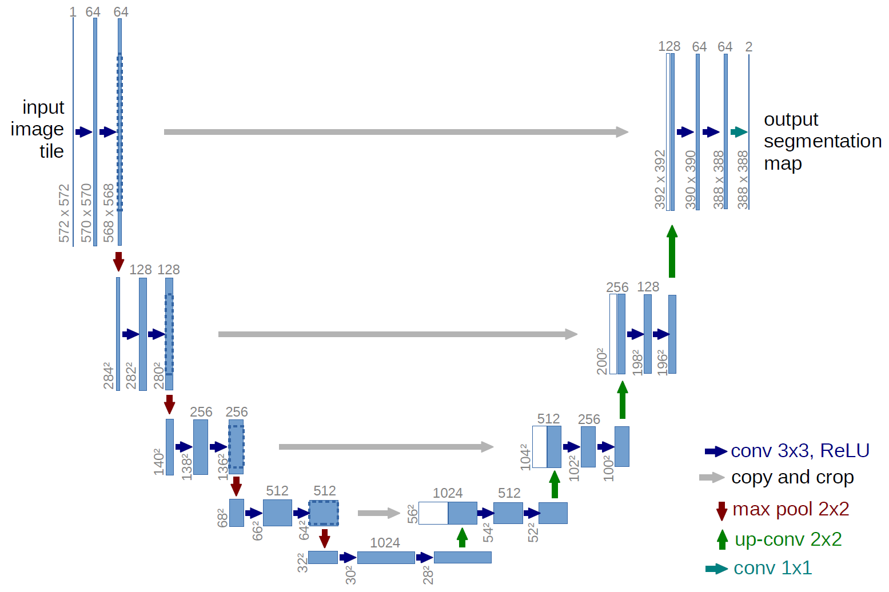

# Visual Saliency Predicition via UNet Semantic Segmentation Model
### UNet Architecture


> ### Disclaimer:
>
> The libraries and dataset materials provided in this repository are not owned by me. They are sourced from various external contributors, publicly available resources, or other repositories. All credit for the original
> work goes to the respective authors and contributors.
> If you are the rightful owner of any content and wish to have it removed or properly attributed, please contact me, and I will address your concerns promptly.

> ### Libraries:
> Segmentation Model: https://github.com/qubvel/segmentation_models

> ### Dataset:
> EgoMon Dataset: https://imatge-upc.github.io/egocentric-2016-saliency/

> ### Paper:
> UNet Paper: https://lmb.informatik.uni-freiburg.de/people/ronneber/u-net/


### Description

Implementation of a Visual Saliency Prediction Model using the UNET Architecture. The pre-build UNet model was imported from an open-source library named "segmentation-models". And it was trained on EgoMon Visual Saliency Dataset.

### Installation Procedure

1. Clone the repository:

    ```bash
    git clone https://github.com/aliaxam153/Visual-Saliency-Prediction-UNET-Model.git
    ```

2. Navigate to the project directory:

    ```bash
    cd Visual-Saliency-Prediction-UNET-Model
    ```

3. Install the Python dependencies using pip:

    ```bash
    pip3 install -r requirements.txt
    ```

    This command will install all the required python packages specified in the `requirements.txt` file.
4. To download and use the pre-trained model, visit this link: https://www.kaggle.com/models/aliazam153/unet-visual-saliency-prediction

